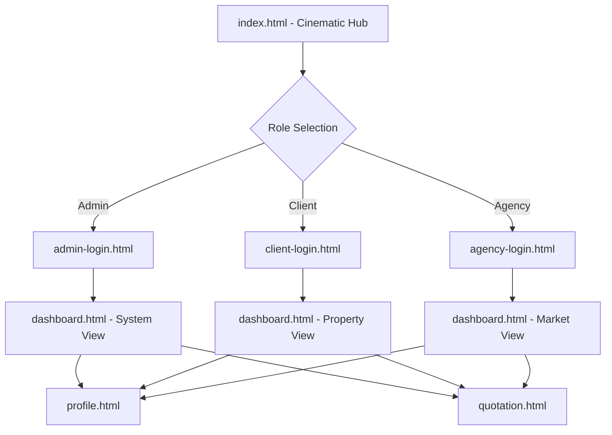

# Architecture & Technical Documentation

This document outlines the blueprints, design tokens, and simulated API structures for **Sale By Design Homes**.

## 1. Architectural Blueprint
The system follows a **Portal Isolation Pattern**, ensuring each user role arrives at a context-aware entry point that is visually and functionally optimized.



## 2. Design Tokens (Sale By Design Theme)
Our "Midnight Obsidian" aesthetic is powered by the following core tokens:

| Token | CSS Variable | HEX Value | Purpose |
| :--- | :--- | :--- | :--- |
| **Primary** | `--primary` | `#2563eb` | Brand actions (Buttons, Highlights) |
| **Surface** | `--surface` | `#ffffff` | Component containers (Light Mode) |
| **Dark Surface** | `--surface` (Dark) | `#0f172a` | Component containers (Dark Mode) |
| **Outline** | `--outline` | `rgba(15,23,42,0.1)` | Subtle structural borders |

## 3. Simulated API Documentation
While currently a static experience, the following JSON structures are anticipated for future backend integration.

### Authentication Endpoint (`POST /api/auth/login`)
**Request Body:**
```json
{
  "email": "user@email.com",
  "password": "hashed_password",
  "role": "admin | client | agency"
}
```

### Property Valuation Mapping
The **Client Portal** uses the following structure for its dynamic gallery:
```json
{
  "property_id": "STAG-942",
  "name": "The Obsidian Loft",
  "current_valuation": 4200000,
  "staging_status": "Complete",
  "image_url": "assets/img/loft.jpg"
}
```

## 4. Maintenance Guidelines
- **Branding**: All updates MUST use "Sale By Design Homes" as the primary branding string.
- **Animations**: Entrance animations are managed via custom keyframes in `style.css`.
- **CI/CD**: The GitHub Action `Website CI/CD` verifies HTML/CSS integrity on every push.
